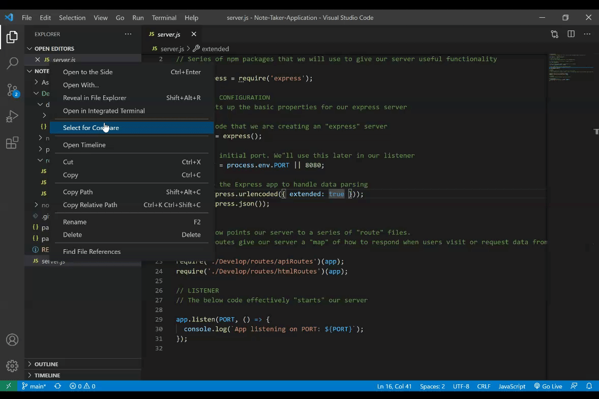

# Note Taker Application
## Description

This application is a simple note taker. It allowes the user to create and save a new note, navigate between different notes and delete any note.

Each note entry provides the user with a Note Title and a Note Text.

The application is deployed on Heroku and can be accessed through the following link: [Note-Taker](https://fathomless-sierra-25537.herokuapp.com/).

## Table of Contents

[Description](#description)

[Technologies](#Technologies-used)

[Installation](#Installation)

[Usage](#usage)

[How-it-Works](#How-it-Works)

[License](#License)

[Badges](#Badges)

[Contributing](#contributing)

[Tests](#tests)

[Deployment](#Deployment)

[Questions](#questions)

## Technologies Used
1. HTML 
2. CSS
3. JavaScript
4. Node.js
5. express
6. uuid 

## Installation
To install the Note Taker Application, follow the following steps:
1. Clone the repo on your local machine
2. Install the web framework for node [express package](https://www.npmjs.com/package/inquirer) `npm install express` command
3. Install [uuid package](https://www.npmjs.com/package/jest) for testing through `npm install uuid` command to create a unique id for each note entry

## Usage
The Note Taker Application is used as a fast application to get organized  and create, save and delete notes.

## How it works
The Note Taker Application has both backend and a frontend aspects. To start the application follow the following steps:

1. Follow the [Installation](#Installation) steps
2. Invoke the application by right clicking on the `<server.js>`file and opn it using Open in Integrated Terminal of Visual Studio Code (VSC)
3. In the Integrated Terminal of VSC, type the ocmmand `Node server.js`
4. App listening on PORT: 8080 message should appeare in the Integrated Terminal

5. In your browser, type localhost:8080 and test the application functionality

The Note Taker Applciatoin is deployed on [Heroku](https://dashboard.heroku.com/apps), to open the deployed application use the following link:  [Note-Taker](https://fathomless-sierra-25537.herokuapp.com/)

## License

## Badges

## Contributing
To contribute to this project, please make sure you follow the guidelines in [The Contributor Covenant](https://www.contributor-covenant.org/) as general guidelines.
Kindly maintain the highest ethics and respect. For further questions or requests kindly contact me through my [Email](mailto:noha_ashraf85@hotmail.com) or [GitHub](https://github.com/NohaAshraf85)

## Tests
The Note Taker Application API get/post and delete methods have been tested using [Insomnia](https://insomnia.rest/)

## Deployment
The [Note-Taker](https://fathomless-sierra-25537.herokuapp.com/) is deployed on Heroku.

## Questions
For any questions, please contact me through [GitHub](https://github.com/NohaAshraf85) 
or [Email](mailto:noha_ashraf85@hotmail.com)

